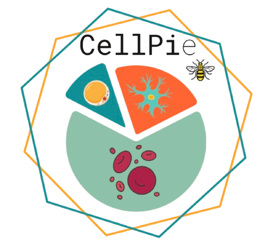

# CellPie

CellPie is a scalable spatial transcriptomics factor discovery method via joint non-negative matrix factorization. Preprint is available here [https://www.biorxiv.org/content/10.1101/2023.09.29.560213v2](https://www.biorxiv.org/content/10.1101/2023.09.29.560213v3)

  

# Installation

To install CellPie we recommend creating a conda environment using the following commands: 

1) Clone the git repo: git clone https://github.com/ManchesterBioinference/CellPie

2) cd into CellPie directory and do: conda env create -f environment_cellpie.yml

3) conda activate cellpie_env

4) You can load a jupyter notebook by typing 'jupyter notebook' in the command line

⚠️ **Warning:** Please note: There is a bug in the branches main_v0 and main_v01. Please use the main version instead.

